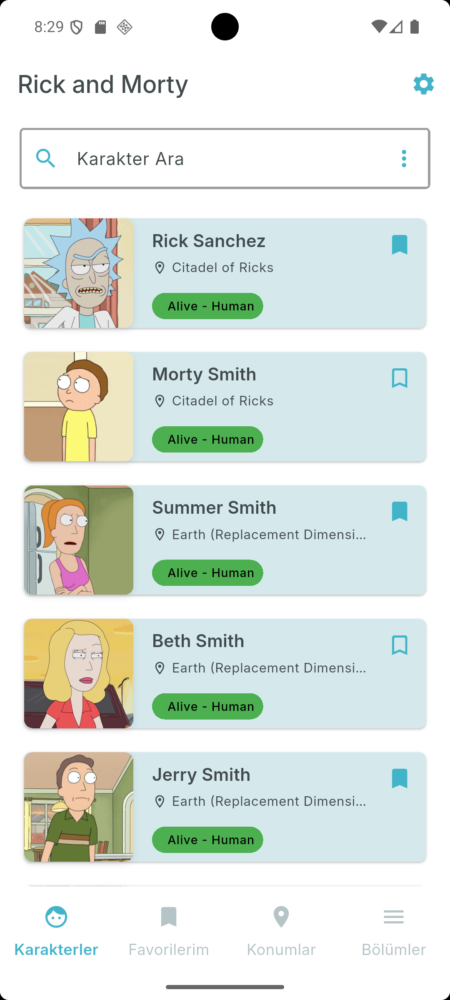
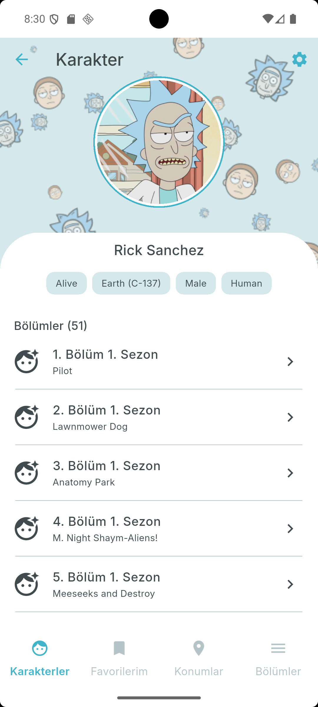
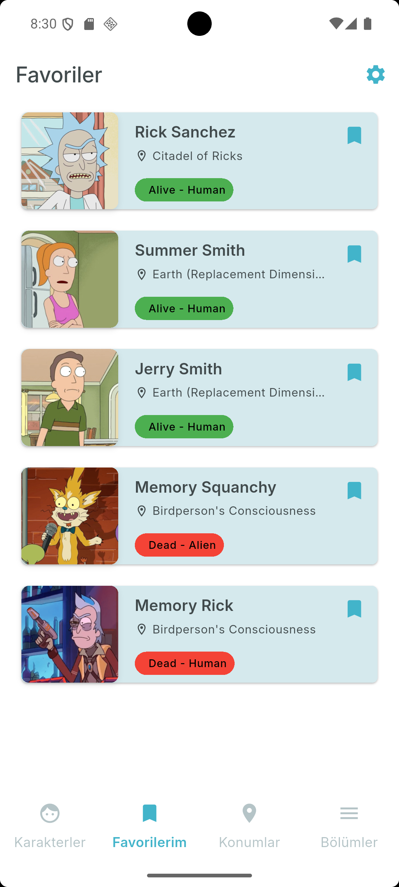
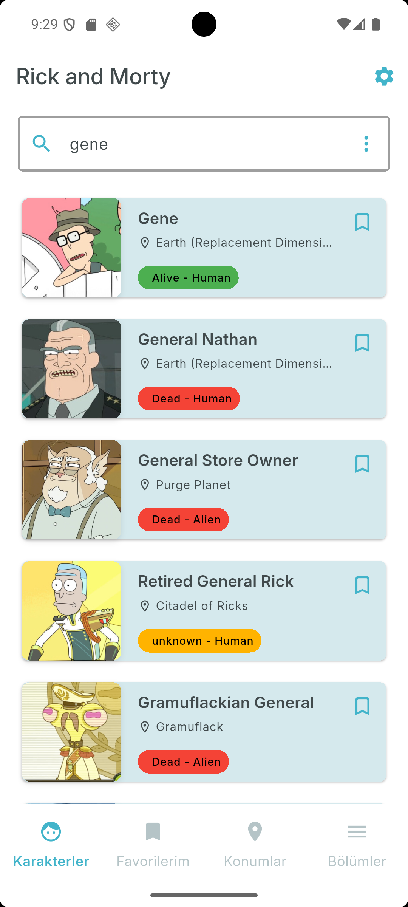
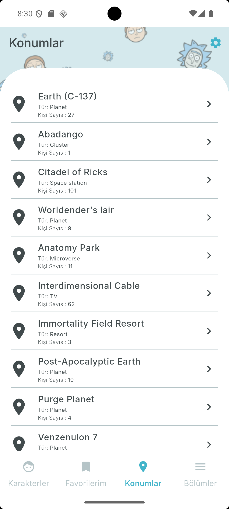
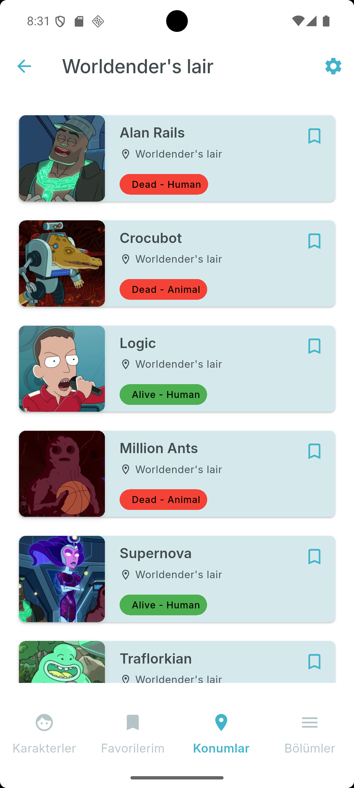
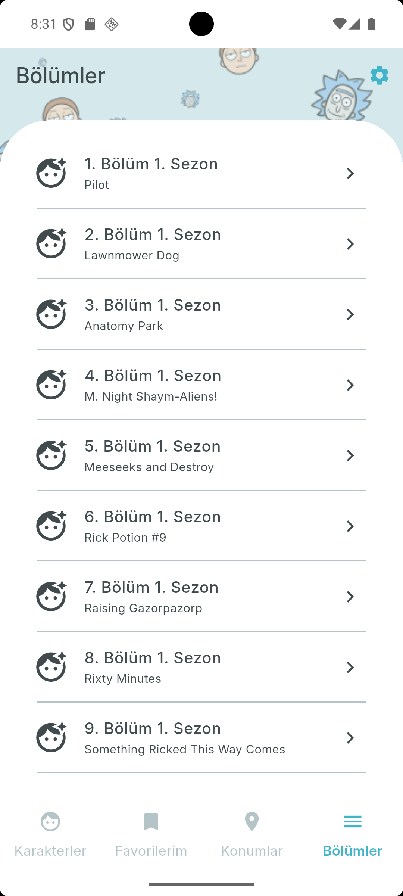
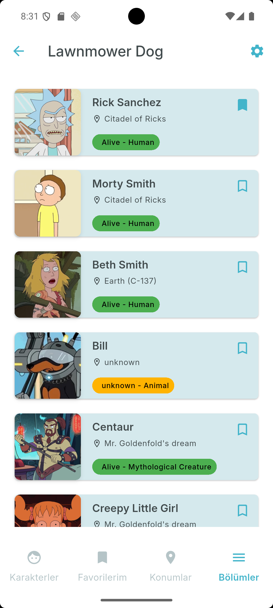

# Rick and Morty Flutter Uygulaması

Bu proje, [Rick and Morty API](https://rickandmortyapi.com/) kullanılarak Flutter ile geliştirilmiş modern bir mobil uygulamadır. Uygulama, karakter listesini ve detay bilgilerini dinamik olarak gösterir. Amaç; Flutter mimarisi, API tüketimi, yönlendirme ve durum yönetimi konularında örnek bir yapı sunmaktır.

## 🚀 Özellikler

- 🧬 Rick and Morty evreninden karakter bilgileri
- ⚙️ Dio ile REST API entegrasyonu
- 🧭 `go_router` ile modern yönlendirme
- 🗂️ Provider + GetIt ile temiz mimari
- 💾 Shared Preferences ile kalıcı veri saklama
- 🧩 Uygulama simgesi desteği (`flutter_launcher_icons`)
- 📱 Android, iOS, Web ve Masaüstü destekli

## 🧱 Kullanılan Paketler

| Paket | Açıklama |
|-------|----------|
| [`dio`](https://pub.dev/packages/dio) | HTTP istek yönetimi |
| [`go_router`](https://pub.dev/packages/go_router) | Sayfa yönlendirme |
| [`provider`](https://pub.dev/packages/provider) | Durum yönetimi |
| [`get_it`](https://pub.dev/packages/get_it) | Servis locator (dependency injection) |
| [`shared_preferences`](https://pub.dev/packages/shared_preferences) | Kalıcı veri saklama |
| [`flutter_launcher_icons`](https://pub.dev/packages/flutter_launcher_icons) | Uygulama simgesi oluşturma aracı |

## 📦 Kurulum

### Gereksinimler

- Flutter SDK (3.x ve üzeri)
- Dart SDK
- Android Studio veya VS Code (Flutter eklentisiyle)

### Adımlar

1. Reposu klonlayın:

   ```bash
   git clone https://github.com/mustafa-altuntas/rickandmorty.git
   cd rickandmorty

2. Bağımlılıkları yükleyin:
    ```bash
    flutter pub get
3. Uygulama simgesini oluşturun (opsiyonel):
    ```bash
    flutter pub run flutter_launcher_icons
4. Uygulamayı çalıştırın:
    ```bash
    flutter run
    ```

## 📁 Proje Yapısı
        rickandmorty/
        ├── android/                # Android yapılandırmaları
        ├── ios/                    # iOS yapılandırmaları
        ├── lib/                    # Ana kaynak kodlar
        ├── assets/
        │   ├── icon/               # Uygulama simgesi
        │   └── screenshots/        # Ekran görüntüleri (README için)
        ├── test/                   # Test klasörü (şu an boş)
        ├── pubspec.yaml            # Paket tanımları
        └── README.md               # Proje açıklamaları

## 📷 Ekran Görüntüleri

Uygulamanın bazı temel ekranları aşağıda gösterilmiştir.


### 🏠 Karakterler (Ana Sayfa) & 👤 Karakter Detay Sayfası

<p float="left">
  
  
</p>

Seçilen karakterin detaylı bilgileri bu sayfada sunulur. Karakterin adı, durumu, türü, cinsiyeti, bulunduğu konum, oynadığı tüm bölümlerin listesi yer alır.

---


### ⭐ Favorilerim & 🔍 Arama Özelliği

<p float="left">
  
  
</p>

Kullanıcının favori karakterleri bu sayfada listelenir.  
Arama özelliği sayesinde kullanıcılar yalnızca karakterler arasında arama yapabilir.  
Girilen anahtar kelimenin geçtiği karakterler listelenir.

---


### 🌍 Konumlar & 👥 Residents (Konuma Ait Karakterler)

<p float="left">
  
  
</p>

Tüm Rick and Morty evrenindeki konumların listesi gösterilir.  
Seçilen konumda yaşayan karakterler detaylı şekilde gösterilir.

---


### 🎬 Bölümler & 👤 Characters

<p float="left">
  
  
</p>

Rick and Morty dizisine ait tüm bölümler listelenir.  
Bölümde yer alan karakterlerin detaylı listesi görüntülenir.

---


